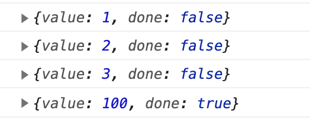
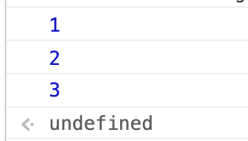

### Iterator/Generator
- Generator: Iterator이자 Iterable을 생성하는 함수

```js
function* gen() {
  yield 1
  yield 2
  yield 3
  return 100
}

let iter = gen() 
// iter는 iterator이자 iterable, iter[Symbol.iterator]() === iter
// 즉, generator 는 well-formed iterator를 return 하는 함수이다.

console.log(iter.next())
console.log(iter.next())
console.log(iter.next())
console.log(iter.next())
console.log(iter.next())
```



- generator의 return은 done===true 일 때 전달되는 값

```js
function* gen() {
  yield 1
  yield 2
  yield 3
  return 100
}
for (const a of gen()) console.log(a)
```


- return의 값은 for of의 순회로 나타나지 않는다.


### Generator라는 문장을 통해 순회할 수 있는 값을 만들 수 있다는
- generator의 의의는 순회할 값을 문장으로 표현하는데 있다.
- 어떠한 값이든 Iterable이라면 순회할 수 있다.
- generator는 문장을 순회할 수 있는 값으로 만들 수 있다.
- generator를 통해 어떠한 값이든 순회할 수 있게 만들 수 있다.


# 홀수 만들기
```js
function *odds() {
  yield 1
  yield 2
  yield 3
}

let iter = odds()
console.log(iter.next())
console.log(iter.next())
console.log(iter.next())
console.log(iter.next())
```
을 발전시켜 보자

```js
function *odds(limit) {
  for (let i = 0; i < limit; i++) {
    if (i % 2) yield i
  }
}

let iter = odds(10)
console.log(iter.next())
console.log(iter.next())
console.log(iter.next())
console.log(iter.next())
```

#### infinity 생성

```js
function *infinity(i = 0) {
  while (true) {
    yield i++
  }
}

function *odds(limit) {
  for (const a of infinity(1))  {
    if (a % 2) yield a
    if (a === limit) return
  }
}

let iter = odds(10)
for (const a of iter) console.log(a)
```

#### limit 생성
```js
function* infinity(i = 0) {
  while (true) {
    yield i++
  }
}

function* limit(limt, iter) {
  for (const a of iter) {
    yield a
    if (a === limit) return
  }
}

function* odds(l) {
  for (const a of limit(l, infinity(1)))  {
    if (a % 2) yield a
    if (a === l) return
  }
}

let iter = odds(10)
for (const a of iter) console.log(a)
```

## for of, 전개 연산자, 구조분해, 나머지 연산자 활용
```js
function *odds() {
  yield 1
  yield 2
  yield 3
}
console.log(...odds())
const [head, ...tail] = odds()
console.log(head, tail)
```